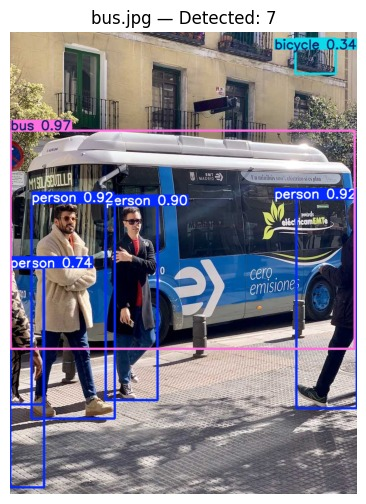
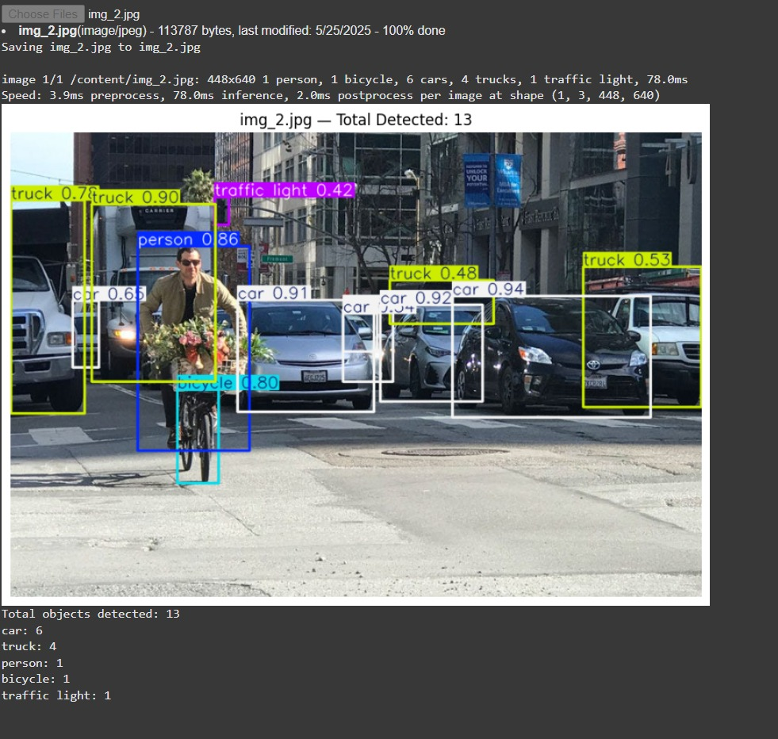

# DetectNCount

## Overview
This project implements an object detection and counting system using deep learning techniques. The system detects various objects in images or video frames and counts their occurrences in real-time or batch processing.

## Features
- Detect multiple object classes using a pre-trained model (e.g., YOLO, SSD, or Faster R-CNN).
- Count the number of detected objects in images or videos.
- Visualize detection results with bounding boxes and labels.
- Support for video stream processing for real-time applications.

## Requirements
- Python 3.x
- OpenCV
- TensorFlow or PyTorch (depending on the model used)
- NumPy
- Other dependencies listed in `requirements.txt`

## Installation
1. Clone the repository
   ```bash
   git clone https://github.com/Nandan-2004/DetectNCount.git
   cd DetectNCount
   ```
   
2. (Optional) Create a virtual environment
   ```bash
   python -m venv venv
   source venv/bin/activate  # On Windows: venv\Scripts\activate
   ```

3. Install dependencies
   ```bash
   pip install -r requirements.txt
   ```

## Usage
```bash
python DetectNCount.py
```
## 📸 Sample Output

Here are some example outputs generated by the object detection and counting system:

### 🔍 Example 1 



### 🔍 Example 2



## License

MIT License. See the [LICENSE](LICENSE) file for details.

## Contributing

Feel free to fork the repository, submit issues, or open pull requests. Contributions are welcome!
